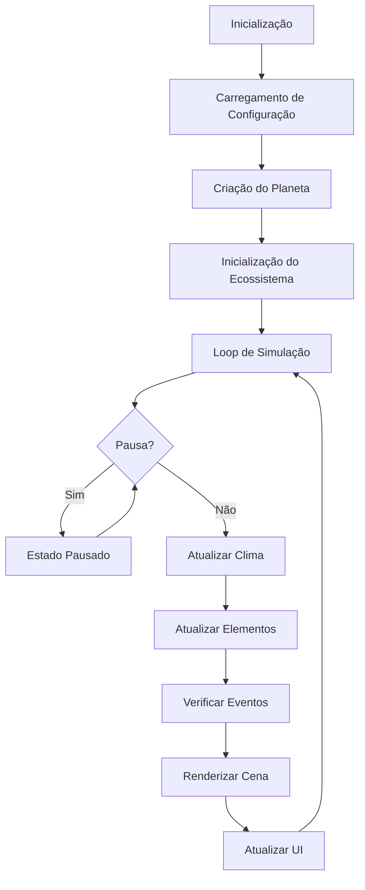
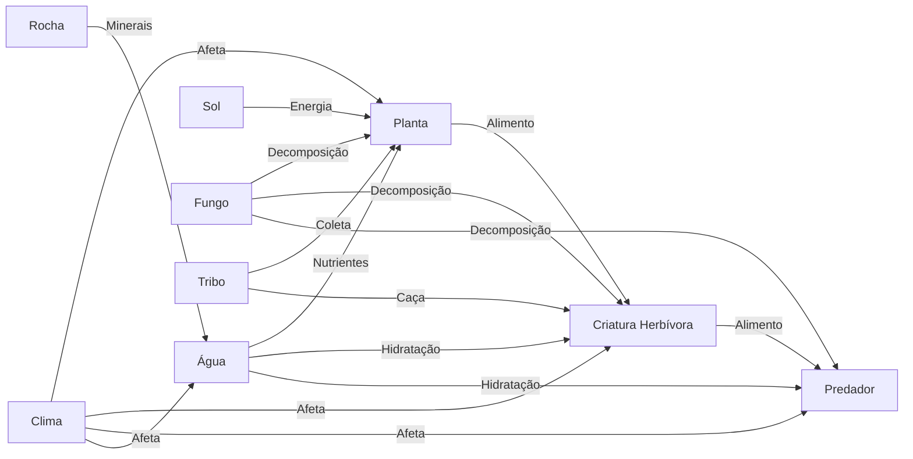
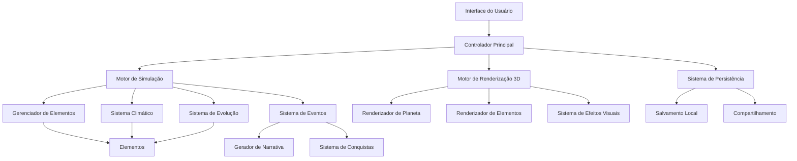

# Design Document - Ecosse™ Enhancement

## Overview

Este documento detalha o design técnico e conceitual para as melhorias do Ecosse™ - Sandbox Planetário 3D. O objetivo é transformar o jogo em uma experiência mais imersiva, viciante e tecnicamente robusta, implementando melhorias em todos os aspectos do sistema.

## Arquitetura

### Estrutura Modular Aprimorada

A arquitetura atual do Ecosse™ já possui uma boa base modular, mas será aprimorada para permitir maior extensibilidade e desempenho:

```
Ecosse/
├── index.html                 # Ponto de entrada da aplicação
├── css/                       # Estilos da interface
├── js/
│   ├── main.js                # Inicialização e coordenação
│   ├── planetRenderer.js      # Renderização 3D do planeta (Three.js)
│   ├── simulation.js          # Motor de simulação do ecossistema
│   ├── elements/              # [NOVO] Módulos para cada tipo de elemento
│   │   ├── baseElement.js     # Classe base para todos os elementos
│   │   ├── plant.js           # Implementação específica de plantas
│   │   ├── creature.js        # Implementação específica de criaturas
│   │   └── ...
│   ├── systems/               # [NOVO] Sistemas de simulação específicos
│   │   ├── weather.js         # Sistema climático
│   │   ├── evolution.js       # Sistema de evolução genética
│   │   ├── narrative.js       # Sistema de geração de narrativas
│   │   └── ...
│   ├── ui/                    # [NOVO] Componentes de interface
│   │   ├── panels.js          # Painéis de controle
│   │   ├── modals.js          # Janelas modais
│   │   ├── tooltips.js        # Sistema de dicas contextuais
│   │   └── ...
│   ├── utils.js               # Funções utilitárias
│   ├── config.js              # Configurações do jogo
│   ├── persistence.js         # Salvamento e carregamento
│   ├── achievements.js        # Sistema de conquistas
│   ├── techTree.js            # Árvore tecnológica
│   ├── scenarios.js           # Cenários e desafios
│   ├── audioManager.js        # Gerenciamento de áudio
│   └── geminiApi.js           # Integração com IA Gemini
├── audio/                     # Arquivos de áudio
│   ├── ambient/               # Sons ambientes
│   ├── effects/               # Efeitos sonoros
│   └── music/                 # Trilhas musicais
└── models/                    # Modelos 3D para elementos complexos
```

### Padrão de Design

Implementaremos os seguintes padrões de design para melhorar a arquitetura:

1. **Entity-Component-System (ECS)**: Para gerenciar elementos do ecossistema de forma mais eficiente
2. **Observer Pattern**: Para comunicação entre sistemas sem acoplamento forte
3. **Factory Pattern**: Para criação de elementos e sistemas
4. **Command Pattern**: Para ações do usuário e histórico de ações
5. **State Pattern**: Para gerenciar estados do jogo e transições

## Componentes e Interfaces

### Sistema de Renderização 3D Aprimorado

O sistema de renderização baseado em Three.js será aprimorado para oferecer visuais mais impressionantes:

1. **Shaders Personalizados**:
   - Shader de água realista com reflexos e refrações
   - Shader atmosférico avançado com dispersão de luz
   - Shaders para efeitos climáticos (chuva, neve, tempestades)

2. **Otimizações de Renderização**:
   - Instancing para elementos repetitivos (plantas, rochas)
   - Level of Detail (LOD) para elementos distantes
   - Occlusion culling para melhorar performance

3. **Efeitos Visuais**:
   - Sistema de partículas para eventos (erupções, chuva, crescimento)
   - Iluminação dinâmica com ciclo dia/noite realista
   - Sombras suaves e realistas

### Motor de Simulação Ecológica

O motor de simulação será expandido para comportamentos mais complexos e realistas:

1. **Sistema de Genética e Evolução**:
   - Genoma expandido para criaturas com mais traços herdáveis
   - Mutações com efeitos visíveis na aparência e comportamento
   - Seleção natural baseada em pressões ambientais

2. **Redes Alimentares Complexas**:
   - Relações predador-presa dinâmicas
   - Cadeias alimentares com múltiplos níveis tróficos
   - Efeitos cascata quando espécies são removidas

3. **Sistemas Climáticos e Ambientais**:
   - Ciclos climáticos sazonais com efeitos no ecossistema
   - Eventos climáticos extremos (secas, inundações, tempestades)
   - Microclimas baseados em topografia e vegetação

### Interface do Usuário Aprimorada

A interface será redesenhada para ser mais intuitiva e informativa:

1. **Painéis Contextuais**:
   - Painéis que se adaptam ao contexto atual
   - Informações relevantes exibidas apenas quando necessário
   - Transições suaves entre diferentes modos

2. **Ferramentas de Análise**:
   - Gráficos de população e recursos ao longo do tempo
   - Mapas de calor para visualizar distribuição de elementos
   - Estatísticas detalhadas sobre o ecossistema

3. **Controles Aprimorados**:
   - Gestos intuitivos para manipulação de elementos
   - Atalhos de teclado configuráveis
   - Modos de seleção avançados (área, tipo, propriedades)

### Sistema de Progressão

Um sistema de progressão mais profundo será implementado:

1. **Árvore Tecnológica Expandida**:
   - Múltiplos caminhos de especialização
   - Tecnologias com efeitos visíveis no ecossistema
   - Desbloqueios que alteram mecânicas fundamentais

2. **Sistema de Conquistas Multinível**:
   - Conquistas básicas, intermediárias e avançadas
   - Recompensas tangíveis por completar conquistas
   - Desafios diários e semanais

3. **Energia do Jogador e Recursos**:
   - Sistema de energia renovável para intervenções divinas
   - Recursos especiais obtidos de eventos raros
   - Economia de recursos para desbloquear conteúdo

## Modelos de Dados

### Elemento Base

```javascript
class BaseElement {
  id;                  // Identificador único
  type;                // Tipo do elemento
  x, y;                // Posição 2D no ecossistema
  health;              // Saúde atual (0-100)
  energy;              // Energia atual
  size;                // Tamanho físico
  age;                 // Idade em ciclos de simulação
  tags;                // [NOVO] Tags para categorização
  attributes;          // [NOVO] Atributos dinâmicos
  
  // Métodos
  update(state);       // Atualiza estado baseado no ambiente
  interact(element);   // Interage com outro elemento
  consume(resource);   // Consome um recurso
  reproduce();         // Tenta reproduzir
  die();               // Processo de morte
  mutate();            // [NOVO] Aplica mutações genéticas
}
```

### Modelo de Genética

```javascript
class Genome {
  traits;              // Mapa de traços genéticos
  dominantGenes;       // Genes dominantes
  recessiveGenes;      // Genes recessivos
  mutationRate;        // Taxa de mutação
  
  // Métodos
  combine(otherGenome);// Combina com outro genoma
  mutate();            // Aplica mutações aleatórias
  expressTraits();     // Converte genes em traços fenotípicos
}
```

### Modelo de Clima

```javascript
class Weather {
  type;                // Tipo de clima (ensolarado, chuvoso, etc.)
  intensity;           // Intensidade do clima (0-1)
  duration;            // Duração em ciclos
  effects;             // Efeitos no ecossistema
  
  // Métodos
  apply(ecosystem);    // Aplica efeitos ao ecossistema
  transition(newWeather); // Transição para novo clima
  createVisualEffects(); // Gera efeitos visuais
}
```

### Modelo de Tecnologia

```javascript
class Technology {
  id;                  // Identificador único
  name;                // Nome da tecnologia
  description;         // Descrição
  cost;                // Custo em recursos
  prerequisites;       // Tecnologias necessárias
  effects;             // Efeitos no ecossistema
  unlocked;            // Estado de desbloqueio
  
  // Métodos
  canUnlock(resources, unlockedTechs); // Verifica se pode desbloquear
  applyEffects(ecosystem);             // Aplica efeitos ao ecossistema
}
```

## Tratamento de Erros

### Estratégia de Recuperação

1. **Salvamento Automático**:
   - Pontos de salvamento automático a cada X ciclos
   - Backup de estados anteriores para recuperação

2. **Validação de Estado**:
   - Verificação de consistência do ecossistema
   - Correção automática de estados inválidos

3. **Logs Detalhados**:
   - Sistema de logging expandido para depuração
   - Rastreamento de eventos para identificar problemas

## Estratégia de Testes

1. **Testes Unitários**:
   - Testes para componentes individuais
   - Verificação de comportamentos específicos

2. **Testes de Integração**:
   - Testes de interação entre sistemas
   - Verificação de fluxos completos

3. **Testes de Desempenho**:
   - Benchmarks para diferentes tamanhos de ecossistema
   - Testes de carga para identificar gargalos

## Diagramas

### Diagrama de Fluxo da Simulação



### Diagrama de Interação entre Elementos



### Diagrama de Arquitetura do Sistema

